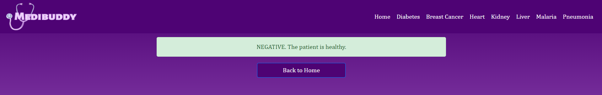
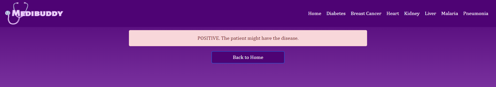

# MediInsight - A One Stop Medical Disease Diagnosis Powered by Machine Learning and Deep Learning

## Overview

MediInsight is an innovative project that leverages the power of machine learning (ML) and deep learning (DL) to provide a comprehensive disease diagnosis solution. By utilizing various ML and DL models, MediInsight aims to accurately predict and diagnose a range of diseases based on user-provided data and images.

### Live Application
[](https://mediinsight.onrender.com/)
### Features

- **Multiple Disease Predictions**: Supports predictions for diabetes, breast cancer, heart disease, kidney disease, liver disease, malaria, and pneumonia.
- **User-Friendly Interface**: Easy-to-use web interface for uploading data and images.
- **Automated Analysis**: Processes and analyzes user inputs to provide quick and accurate disease predictions.
- **Integration with ML/DL Models**: Seamlessly integrates multiple machine learning and deep learning models for various diseases.

### Demo

Check out the live demo: [MediInsight](https://mediinsight.onrender.com/)

## Installation

To run MediInsight locally, follow these steps:

1. **Clone the repository:**
   ```bash
   git clone https://github.com/yourusername/MediInsight.git
   cd MediInsight
   ```

2. **Create a virtual environment and install dependencies:**
   ```bash
   python -m venv venv
   source venv/bin/activate  # On Windows, use `venv\Scripts\activate`
   pip install -r requirements.txt
   ```

3. **Download the necessary models and place them in the `models` directory.**

4. **Run the application:**
   ```bash
   python app.py
   ```

   The application will be accessible at `http://127.0.0.1:5000/`.

## Usage

1. **Home Page**: Navigate to the home page to select the type of disease you want to diagnose.
2. **Upload Data**: Depending on the disease, upload the necessary data or image.
3. **Get Prediction**: Click on the predict button to get the diagnosis result.

## Supported Diseases

### 1. Diabetes
   - Requires 8 input values including BMI, Insulin, and Glucose levels.
   - Uses a Random Forest model.

### 2. Breast Cancer
   - Requires 22 input values.
   - Uses a pre-trained ML model.

### 3. Heart Disease
   - Requires 13 input values.
   - Uses a Random Forest model.

### 4. Kidney Disease
   - Requires 24 input values.
   - Uses a pre-trained ML model.

### 5. Liver Disease
   - Requires 10 input values.
   - Uses a pre-trained ML model.

### 6. Malaria
   - Requires an image upload.
   - Uses a Convolutional Neural Network (CNN) model.

### 7. Pneumonia
   - Requires an image upload.
   - Uses a Convolutional Neural Network (CNN) model.

## Code Highlights

### Model Prediction Example
```python
def predict(values, dic):
    # Example for diabetes prediction
    if len(values) == 8:
        model = pickle.load(open('models/diabetes_rf_model.pkl', 'rb'))
        values = np.asarray(values)
        return model.predict(values.reshape(1, -1))[0]
    # Add similar logic for other diseases...
```

### Handling Image Uploads
```python
@app.route("/malariapredict", methods=['POST', 'GET'])
def malariapredictPage():
    if request.method == 'POST':
        try:
            img_file = request.files['image']
            filename = secure_filename(img_file.filename)
            img_path = os.path.join('uploads', filename)
            img_file.save(img_path)
            
            img = tf.keras.utils.load_img(img_path, target_size=(150, 150))
            img = tf.keras.utils.img_to_array(img)
            img = np.expand_dims(img, axis=0)
            
            model = load_model("models/malaria_detect.h5")
            pred = np.argmax(model.predict(img))
            
            os.remove(img_path)  # Clean up by deleting the uploaded image
            
            return render_template('malaria_predict.html', pred=pred)
        except Exception as e:
            message = f"Error: {e}"
            return render_template('malaria.html', message=message)
    return render_template('malaria.html')
```

## Contributions

We welcome contributions to enhance MediInsight. Here's how you can contribute:

1. **Fork the repository** on GitHub.
2. **Clone your forked repository** to your local machine:
   ```bash
   git clone https://github.com/yourusername/MediInsight.git
   cd MediInsight
   ```
3. **Create a new branch** for your feature or bugfix:
   ```bash
   git checkout -b feature-branch
   ```
4. **Make your changes** and commit them:
   ```bash
   git commit -m "Description of your changes"
   ```
5. **Push your changes** to your fork:
   ```bash
   git push origin feature-branch
   ```
6. **Open a Pull Request** on the main repository.

For any issues or bug reports, please open an issue on GitHub.

## License

This project is licensed under the MIT License. See the [LICENSE](LICENSE) file for more details.


## Sample images of the web application

### Home Page

<br>

### Diabetes Predictor

<br>

### Breast Cancer Predictor

<br>

### Malaria Predictor

<br>

### Negative Result Page

<br>

### Positive Result Page

